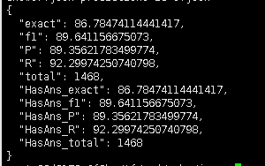

# event_extraction_finance
面向金融领域的实体抽取，从新闻事件中抽取出发生这个事件的主体（公司）是什么？

第一次模型评测结果10_6 fune-tune，10_7 evaluation

    {
        "exact ": 87.99102132435466,
        "f1 ": 87.99102132435466,
        "total ": 1782,
        "HasAns exact": 85.42234332425068,
        "HasAnsfl": 85.42234332425068,
        "HasAnstotal": 1468,
        "NoAns exact": 100.0,
        "NoAnsfl": 100.0,
        "NoAnstotal": 314
    }

一个bug，解析出来的答案prediction是有答案的格式是['str',(start:int,end:int)]，无答案为空

导致评测的程序错误处理数组和str--TODO，是不是run_squad发生了改变?

一些简单的解读： EM值和F值几个都是一致的 刚开始是程序有bug，SQuAD处理evaluation的时候是英文token，是按空格分词 ，而中文需要一个字算一个位置

--TODO：SAC资本，划分成了S A C 资 本来分析，英文串是否需要考虑成一个呢？

    {
        "exact": 87.99102132435466,
        "f1": 90.715851918643,
        "total": 1782,
        "HasAns exact": 85.42234332425068,
        "HasAns f1": 88.73000553066876,
        "HasAns total": 1468,
        "NoAns exact": 100.0,
        "NoAns fl": 100.0,
        "NoAns total": 314
    }

基本的正确率可以达到90%左右

测试有答案是1468，无答案是314；从大数据当中分层抽样出来，比例应该是一致的 无答案的情况为其他--训练的过程中有可能会过拟合，成功匹配100%
实际上应该是上游任务事件类型detection的任务，发现不了句子里面的事件类型，从而给了它一个其他 大概率训练出来是其他->无答案的表面线索，可以试试看问一个具体的事件类型，然后回答无答案

对于模型的训练，也许可以试着把其他替换成每一个类型的随机问题去问--这样也许能保证half，half的配比**（后来分析不可行**

正常有答案的是88%的正确率，先把这一部分的就是没有匹配出来的数据拿出来，分析一下它们可能存在什么理解上的问题

有一大部分是， 比如说宝钢信用抽成了宝钢 SAC资本抽成了SAC

想想怎么解决？ --method1，有监督的方法，做一个词典，然后适当修正，当做子集，姑且算他对，但是对评测结果的影响极小

--太长的target难以抽出，可能和数据初始分布有关，大多数的答案都是1-5 --有些抽出过于长的答案，几乎是一整句话,（Lmax）给截断一下

QAInput('业绩上涨', '山河智能(002097)遭股东减持700万股湘潭电化(002125)电解锰全线停产每月营收减少1500万'),
Inference一条，出现问题，其他的训练过于强了，遇到其他提问，倾向于抽取出“有问题的企业”，实际上应该是没有答案的情况 替换其他

仔细看了一下其他部分的数据 C：………… Q：其他 A:NAN 由于这个金融事件主体抽取其实是有一个上游任务，叫事件发现 其他里面属于是上游任务的一个错误累计 有些确实是没有事件，有些是有事件，但是没有能够抽取出来
对于说有事件的这部分，如果把它设置成问题每个问题，都回答不出来，那就比较麻烦了

    一个idea：用bert重新去做上游任务，cls处做一个分类器，分类每种事件类型，train
    一下，然后可以修复部分没有答案的情况，但是只能说是丰富的数据集。目前机器限制的
    情况下，暂时不考虑其他的情况，对每个句子提问CQA同时C Qother A--no answer

改变处理数据集的方法，no answer为当前Q以外的其他Q均为no answer
但是不能给模型倾向
举个例子，之前全是有answer，然后其他no answer，那么现在各种提问都会强行抽取东西，而no answer只对应其他（比较极端的100%的比例）
如果给到训练集有答案的比较多，他就会倾向于抽取答案，而不给no answer
那么现在设计问题的时候，最好保证50%，50%的设计倾向
17815（全部）-3141（其他）=14676
然后这14676随机采样一个另外的问题类型，然后设置为no answer

透过这样的设计，不知道有没有可能，去询问其他类型的数据
然后不依赖上游任务，把这些没有被识别出来的类型给识别出来

重新做了一次，看起来效果好了很多：
包含no-answer的生成式样本测评结果

    {
        "exact": 91.79155313351498,
        "fl": 93.21976089884444,
        "total": 2936,
        "HasAns exact": 86.78474114441417,
        "HasAns f": 89.641156675073,
        "HasAns total": 1468,
        "NoAns exact": 96.7983651226158,
        "NoAns fl": 96.7983651226158,
        "NoAns total": 1468
    }
回答“不可回答”问题的能力大幅度提升，并且能够判定什么是不可回答的问题

原始问答的生成结果，全部为有答案的情况

    {
        "exact": 86.78474114441417,
        "fl": 89.641156675073,
        "total": 1468,
        "HasAns exact": 86.78474114441417,
        "HasAns f1": 89.641156675073,
        "HasAns total": 1468
    }

相比于最初的原始状态，只看有answer的部分，88左右，现在也提升到89了

Inference三组数据：

    QAInput('业绩上涨', '山河智能(002097)遭股东减持700万股湘潭电化(002125)电解锰全线停产每月营收减少1500万'),
    QAInput('交易违规', '山河智能(002097)遭股东减持700万股湘潭电化(002125)电解锰全线停产每月营收减少1500万'),
    QAInput('不能履职', '成都中禾投资公司老板跑路 专家忧年底或现倒闭潮昆百大A(000560)重要股东累计减持5850万股'),

输出结果为

    湘潭电化（没有训练到的问题类型，机器肯定认为业绩上涨接近业绩下滑--表面clue，没有真正理解语言
    no answer（先可以理解为，可以在有限的问题类型（训练到的）里面判断出无答案
    成都中禾投资公司

##关于不在这21个问题类型里面的回答
目前的泛化性研究肯定是不行的
一种方法是生成随机问题，然后去询问，得到无答案
但个人觉得这部分没有必要，可以参考专家系统，程序过滤，或者做一个分类器
论文--Adaptive Mixtures of Local Experts
http://www.cs.toronto.edu/~fritz/absps/jjnh91.pdf
一些bert模型专门分类业绩不好的情况，一些bert模型专门分类业绩表现好的情况

todo：最后再分析一下看看哪些表现不太好，基本上就差不多了
然后可以做一下ner问题

PRF

随机query查询

    QAInput('高管负面', '今年6月，经检察机关批准，广州警方以涉嫌组织、领导传销活动罪对云联惠公司实际控制人黄某等主要犯罪嫌疑人执行逮捕'),
    QAInput('我爱你', '今年6月，经检察机关批准，广州警方以涉嫌组织、领导传销活动罪对云联惠公司实际控制人黄某等主要犯罪嫌疑人执行逮捕'),
    QAInput('业绩下滑', '今年6月，经检察机关批准，广州警方以涉嫌组织、领导传销活动罪对云联惠公司实际控制人黄某等主要犯罪嫌疑人执行逮捕'),
    QAInput('蜜雪冰城甜蜜蜜', '今年6月，经检察机关批准，广州警方以涉嫌组织、领导传销活动罪对云联惠公司实际控制人黄某等主要犯罪嫌疑人执行逮捕'),
    QAInput('营收爆增', '今年6月，经检察机关批准，广州警方以涉嫌组织、领导传销活动罪对云联惠公司实际控制人黄某等主要犯罪嫌疑人执行逮捕'),
    QAInput('北京大学', '今年6月，经检察机关批准，广州警方以涉嫌组织、领导传销活动罪对云联惠公司实际控制人黄某等主要犯罪嫌疑人执行逮捕'),
    QAInput('高管正面', '今年6月，经检察机关批准，广州警方以涉嫌组织、领导传销活动罪对云联惠公司实际控制人黄某等主要犯罪嫌疑人执行逮捕'),

    输出结果：
    云联惠公司，正确抽取
    空
    空
    空
    空
    云联惠公司（？？？不知道为啥了）
    云联惠公司（学习的泛化性，把营收上涨和下滑视作同一类，不会区别）

我对这个的理解是，新的query进来，这个模型基于bert encode了query部分，他会映射到和它最像的query上去，然后基于此往下分析
而不会意识到上涨和下跌是相反的，或者正面与负面是相反的
（有没有必要去训练random query）

# 错误预测分析
#1.多个目标实体的场景
"105472","”“大集金服和青岛海航地产开发有限公司都是海航集团的公司，逾期罚息率为每天0.05%，就应该按照合同约定的执行，“我觉得他们涉嫌自融或与关联方融资，从张先生的合同上","涉嫌非法集资","青岛海航地产开发有限公司"

"105163","2018-07-3015:27:05中国法院网讯?(王希玉宋绍忠)　　7月27日至30日，山东省高唐县人民法院对被告单位山东源大工贸有限公司、山东赛雅服饰有限公司以及被告人于西明、于家乐、苏银霞、张振永、程笑、樊正安涉嫌犯非法吸收公众存款罪一案，依法公开开庭审理","涉嫌非法集资","山东源大工贸有限公司"

"105489","唐小僧？这名起的，明着告诉你它目标是西天，你还跟……近几年非法集资的特大案件1、善林金融：600亿元2、e租宝：762亿元3、中晋系：400余亿元4、钱宝网：未兑付金额达300亿元5、泛亚：430亿元6、MMM互助金融平台：15亿美元我解读：在金融圈久了之后，我发现一个问题","涉嫌非法集资","MMM互助金融"

多个有问题的实体，标注只有一个；抽取也只有一个，或者有些长的干脆直接抽取了一整句话

虽然说没有样例数据，但是可以试着做一下bert-mrc-sl单目标实体抽取

#2.抽对了，标注错了
"212173","履新总裁半年即遭叫停 正德人寿免去郑永刚职务晚间公告:中核钛白(002145)定增募10亿 *ST传媒(000504)信披违规被立案","信批违规","中核钛白"

后面又看了一下，*st应该是个特殊符号，处理掉；像这种数据不太干净的情况，搜了一下000504是南华生物

（大量而干净的数据比较重要）

#3.比较有歧义的情况，抽取出离clue近的
"101919"," ????????（殷晓斌与刘建华）????????（会员报单文件）????文/深观评论????日前，深观评论接到举报材料发表了《云惠富通车房俱乐部涉嫌非法集资近10亿创始人殷晓斌为云联惠总部董事》一文，揭露了云惠富通车房俱乐部（运营方为湖南云惠富通网络科技有限公司）依靠庞氏骗局模式维系其5倍投资回报率的项目，涉嫌非法集资近10亿","涉嫌非法集资","云惠富通车房俱乐部"

A（然后说它是由B运营）打了括号，正确答案是A，预测的是B；

我觉得是，模型利用表面clue的原因，它并不能理解（的含义，在内部处理的时候，就觉得是B了，抽取出离得近的

"212077","主业亏损两面针(600249)出售中信证券(600030)股票被指粉饰报表聚美优品们别只甘心做个假货“搬运工”","财务造假","两面针"

好几个这种A出售B，然后实际发生是A；抽取出来是B

"212098","层层隐患终爆发 金汉斯陷入关店闹剧溢价两成增持中百集团 永辉超市再掀股权争夺战","实控人股东变更","中百集团"

"102416"," 目前已被深圳公安局查封，深圳电视台曝光：然而，去年刚刚深陷“魏则西”事件的百度，如今又公然为传销团伙打起了百度竞价广告：513积分项目，武夷山市五一三多元素茶业有限公司：疏通经络DDS仪器骗局：隆力奇168共享经济平台、德加D+7Mall微商骗局、NHTglobal（然间环球）、罗麦科技传销、云集微店、湖南铁皮石斛等等","涉嫌传销","罗麦科技"

"103049"," 自建资金池有网贷公司人均““吸““一亿元2018年6月，位于佛山市禅城区的安稳投资管理咨询有限公司突然人去楼空，公司““理财咖““平台无法提现","提现困难","安稳投资管理咨询有限公司"

"104861"," 近日，江苏南通地区不少客户反映中艺云联文创（北京）文化科技有限公司（原名“中艺财富画院有限公司”）集资诈骗10多亿元","涉嫌非法集资","中艺云联文创（北京）文化科技有限公司"

"203456","泽熙影响持续蔓延 康强电子(002119)重组或生变微软、联想、国美联手“严打”盗版","重组失败","泽熙"

感觉还是没有真正深层次的去理解语言，受XXX影响，这个已经发生，然后XX或生变，或有是未发生，可能大概率发生，模型推断不出来

百度给ABCD打传销广告，传销的是ABCD，抽取出了百度

#4.专业领域词汇较多，理解有限
"205538","光线传媒(300251)、华谊兄弟(300027)正大举抛售游戏股 影游婚姻走到了头万科A(000002)“迷途”:安邦加入股权争夺 野蛮人or白衣骑士","实控人股东变更","万科A"

直接让我来理解，我都不太能get到什么迷途，野蛮人，白衣骑士

# 5.分词不太对
"200843","风范股份:三名股东拟合计减持不超1.13%股份康美药业(600518)造假门发酵 市值蒸发超50亿本周跌幅第一豫商集团承认一致行动人短线交易","交易违规","豫商集团"
抽取结果：第一豫商集团
我觉得这种类似于之前的用有监督的方式可以修正，一个词典

#6.倾向于抽取短的答案
"103003"," 7月13日，上海市公安局浦东分局官方微博发布警方通报称，唐小僧母公司资邦(上海)投资控股有限公司法人陶蕾等人因非法吸收公众存款罪，经浦东新区人民检察院批准被执行逮捕","高管负面","资邦(上海)投资控股有限公司"

A的母公司B犯了什么事儿，A很短，B很长，，这种时候B更近，但是估计没有把它当成是公司，抽取出了A

Inference验证

    QAInput('高管负面', '天星数科的母公司小米科技有限责任公司法人雷军近期被指控进行违规交易，各大媒体纷纷发表不同的观点'), 
    QAInput('高管负面', '天星数科的母公司小米法人雷军近期被指控进行违规交易，各大媒体纷纷发表不同的观点'),
    QAInput('高管负面', '7月13日，上海市公安局浦东分局官方微博发布警方通报称，唐小僧母公司资邦(上海)投资控股有限公司法人陶蕾等人因非法吸收公众存款罪，经浦东新区人民检察院批准被执行逮捕'),

抽取结果是天星数科，天星数科，唐小僧
回看训练样本，大量包含母公司的数据都是：“A的母公司涉嫌交易违规，被查处”，然后抽取结果为A，说明模型学习到的是抽取母公司前面的东西

#7.超级长的文本
"104191"," 溪山粉彩、富贵春的行骗者你们还好吗？安徽文化艺术品交易中心上当受骗者维权者加群举报青岛西海岸新区新都电子公司工会主席树忠祥用钱摆平一条人命倒霉！我家的海尔家电又出问题了南阳卷烟厂李华退休待遇问题黑幕重重，同时冒出三个李华血泪控诉湖南衡东机油泵公司董事长许仲秋违法立功可连续三任“全国人大代表“???中商系布局P2P的真实目的，从金盈所的自融说开去！零钱罐之前找的央企爹失信，又爆料几次发假标，超高活期，还是高返平台郑州棉花交易市场有限公司茶叶票，普洱茶电子盘诈骗事实，希望大家转帖！易乾宁集资**案追踪：一分公司3名总监非吸金额就超3亿元湖北永恒太阳能公司以高收益诱惑投资者涉嫌“非法集资”当地政金贝猫发”连号”公司假标自融涉旌逸集团庞氏骗局娄底骨伤科医院是一家是缺德医院、害人医院！河北移联网信集团涉嫌非息和非法集资希望大家能联合起来一起去维权！广州诺正、华熙首信等多家公司涉嫌“原油”诈骗河北省邯郸市馆陶县人民医院一患者被诊断心脏病?患者举报医院伪造病历致患者保单被山西省肿瘤医院院长徐均利用职务之便暗箱操作项目招标卡比乐益智玩具童车加盟骗局广州卡比乐玩具公司诈骗圈套南昌市生殖医院莆田系骗子医院黑医院，坑人的骗子凯乐科技旗下抱财网疑疯狂发假标自融大批空壳公司集结于海淀一办花木金融问题重重被网友深扒爆料，投资需谨慎！石家庄白求恩医院真不是东西，坑人骗人分秒金融被曝料配景作假疑似自融!咸宁现代医院男科莆田人开的黑医院揭开礼德财富的面具：借款公司成立一月营收400万多连号公司组团君融贷涉嫌违规担保，，背后竟涉及两家上市公司和一著名VC","涉嫌欺诈","旌逸集团"

可能和程序处理过程中的截断有关系，不过也是有点像1多实体的问题

#8.unk
"207638","*STCN*解读:长园集团(600525)股权争夺战现“三国杀”格局理想固网股东减持74万股","实控人股东变更","长园集团"
抽出STCN

"207744","easy-forex：*西班牙*评级遭下调加剧恐慌会计调整致连亏海鸟发展(600634)*ST前股东疯狂减持","评级调整","easy-forex"

"206303","辽宁方大集团(000055)清仓东北制药(000597)_新华社_:郭文贵海航“爆料”调查 遥控“内鬼” 获取内部信息方硕科技总经理潘旭东辞职","不能履职","海航"

一个是倾向于抽取英文，一个是倾向于抽取冒号前面的东西

训练样本里有一些这种：
"203192","DeltaStock:最新欧元、英镑和日元短线交易策略库克出售苹果公司股份套现3600万美元","交易违规","DeltaStock"

抽取整段话的情况

#9.存在对抗的情况
"206112","*ST南化(600301):撤销退市风险警示 7日停牌一天快讯:*大摩维持前程无忧减持*评级下调目标价","评级调整","前程无忧"

调研了一下技术：
多实体的问题：BERT-MRC-SL--数值抽取多数值是怎么处理的呢？
词典修正的问题，因为这些公司名其实都是上市公司，其实做一个上市公司的list，然后基于这个list去修正nbest里面的结果，同时打分--可以修正很多问题

没有真正理解语言，比较多的情况是倾向于找最近的，或者说训练到的情况
回到数值抽取，华为比小米的市值高，为1000元，这个1000元怎么保证学习到华为？是样本数据足够大，还是设计的正样本呢
学出来了A比B高，为1000，值得是A
这里就没有学习到A的母公司B怎么了，应该抽取出B，只学习到了A的母公司出事了，抽取了A

还有一种局限性，就是不管是GPT，或者说是BERT走出来的预训练模型，都是基于LM或者MLM，再底层还有word embedding，它的底层怎么说都还是具有一定的常见的，比较连贯和通顺的句子
有一些比较晦涩的情况，不太连贯，例如说内鬼，韭菜，熊市之类的，word embedding层未必能够有这些先验的信息，像这种抽取不太准

其次，因为没有evaluation的正确答案，我是选取了train的部分拆分
现在考虑一下把整个train都按照采样无答案的方法送进去训练
